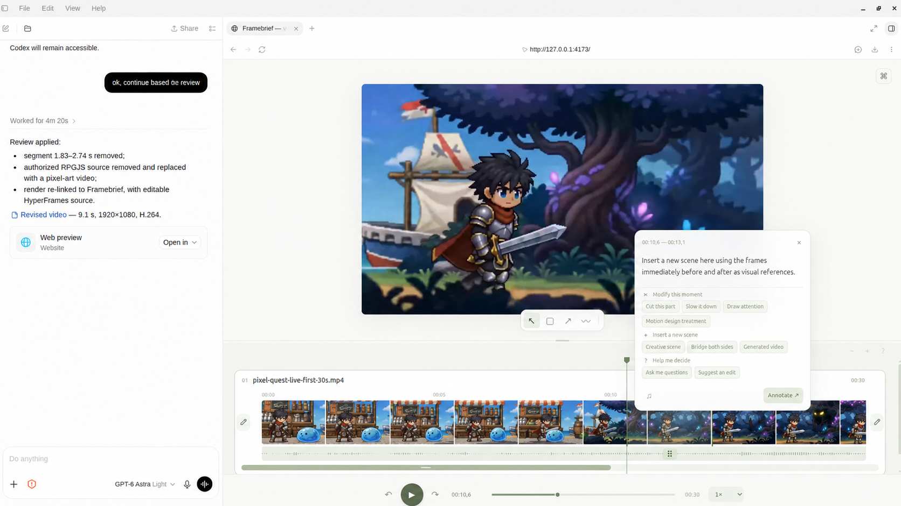

# Framebrief



**Framebrief is the visual review workspace for AI-assisted video editing.**

Instead of trying to describe every edit with technical words, drop in a video, point at the exact moment or area, draw if useful, and write what you mean. Your AI agent receives the prompt, time range, drawings, reference frames, and any destination you selected—then uses the right production tool to do the work.

## Start in three steps

### 1. Install the review skill for your AI agent

The skill installs the Framebrief CLI automatically when needed. It also tells the agent how to open Framebrief after a preview or render, wait for your review, read your annotations, apply only the approved changes, and reopen the updated result for the next pass.

**Codex**

```bash
npx skills add RSamaium/framebrief --skill video-annotation-review --agent codex -g --full-depth
```

**Claude Code**

```bash
npx skills add RSamaium/framebrief --skill video-annotation-review --agent claude-code -g --full-depth
```

For another skills-compatible agent, replace the value after `--agent` with its identifier.

### 2. Ask your agent to create or edit a video

The agent creates a short preview first, opens Framebrief in its integrated browser, and asks you to review it. When you are finished adding notes, simply tell the agent that you are done. It then applies the submitted review and opens the next version.

## What you can do in Framebrief

- Drop video and audio files directly onto the scene.
- Work with several video and audio tracks, then move or insert a selected passage into another track.
- Click a timeline to annotate one exact moment, or drag across it to annotate a range.
- Draw a rectangle, arrow, or freehand mark directly on the preview to show what you mean.
- Use plain-language suggestions such as **Cut this part**, **Slow it down**, **Remove green screen**, or **Draw attention**.
- Insert a new scene before, after, or between existing shots. For a middle insertion, Framebrief attaches the frames before and after the gap as visual references.
- Add an introduction, title, continuation, conclusion, call to action, or a newly generated shot.
- Build deterministic compositions, animated text, transitions, and overlays with HyperFrames.
- Generate a new image, video, music, or voice only through an explicitly approved provider such as fal.ai or Replicate.
- Let the agent use FFmpeg behind the scenes for native edits such as cuts, trimming, crops, rotation, speed changes, audio mixing, and export.
- Use `@` in a prompt on a single moment to cite a frame from another video. On a selected range, use it to choose where that passage should be inserted.
- Annotate video sound or an imported audio track, including a desired volume.
- Reopen any annotation from the timeline, edit it, delete it, or undo/redo a change.

## A typical review

1. Ask your agent to make a video, a 10-second preview, or an edit to existing footage.
2. Framebrief opens with the rendered video already loaded.
3. Add visual notes, for example: “remove the green screen throughout this video”, “make this moment slower”, or “insert a new scene here that connects these two shots”.
4. Tell the agent when you are done reviewing.
5. The agent reads the exact review, updates the correct source (HyperFrames, FFmpeg, Remotion, Manim, or an approved AI provider), and gives you the next version to review.

## Useful shortcuts

| Shortcut | Action |
| --- | --- |
| `Space` | Play / pause |
| `←` / `→` | Move 0.1 seconds |
| `Shift` + `←` / `→` | Move 1 second |
| `R` / `A` / `D` | Rectangle / arrow / freehand drawing |
| `V` | Select and move a drawing |
| `Ctrl/Cmd + Z` | Undo |
| `Ctrl/Cmd + Enter` | Save the prompt |
| `Ctrl/Cmd + K` | Project and import/export commands |

<details>
<summary>Advanced: workspace, automation, and integrations</summary>

Framebrief keeps a workspace checkpoint in `video.review.json` and a production brief in `VIDEO.md`. Video and audio media are copied into `.framebrief/media/` when using the local workspace server. This allows an agent to resume the correct project instead of reusing an unrelated browser session.

The skill uses each media item’s source metadata to choose the correct editing path: it updates a HyperFrames, Remotion, or Manim source when present, and uses FFmpeg for native-video operations. AI providers remain opt-in and must be explicitly authorized in `VIDEO.md`.

When supported by the browser, WebMCP exposes the same project, annotation, reference-image, and frame-capture data to the agent. WebMCP is optional: the core review workflow works without it.

In the annotation data, a point mention is saved as `mediaReference: { videoId, time }`; a range insertion uses `destination: { videoId, time }`. Both times are seconds in the linked video.

</details>

## Development

```bash
npm install
npm run dev
npm test
```

## Publishing

Releases are published to npm by GitHub Actions when a version tag is pushed. Before the first release, configure **npm Trusted Publishing** for the `framebrief` package with GitHub owner `RSamaium`, repository `framebrief`, and workflow filename `publish.yml`. Allow direct `npm publish`; no long-lived npm token is needed in GitHub secrets.

For each release, update the package version, commit the change, and push a matching tag such as `v0.1.2`. The workflow verifies that the tag matches `package.json`, runs the tests and build, inspects the package contents, then publishes it to npm using OIDC.

## License

[MIT](LICENSE)
